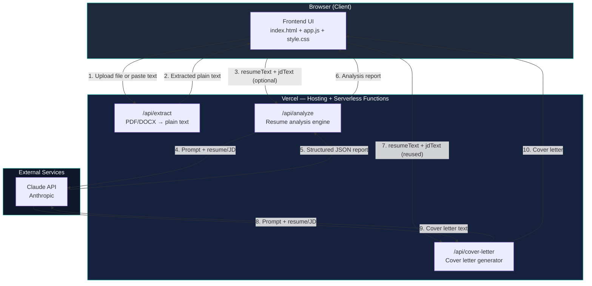
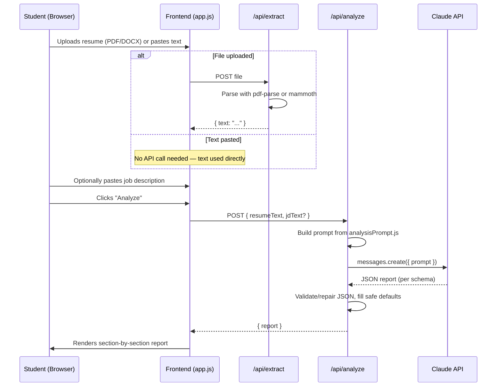

# AI Career Copilot — System Architecture

**Status:** Finalized Day 2 | **Stack:** Vanilla JS frontend + Vercel Serverless Functions + Claude API | **Storage:** None (stateless)

---

## 1. Component Diagram

**Why this shape:** three independent, single-purpose serverless functions instead of one monolithic API. Each maps to exactly one blueprint feature (Day 4 parsing, Day 5 analysis, Day 7 cover letter), so implementation days can build and test them in isolation without touching working code.

---

## 2. Data Flow (End-to-End)

---

## 3. Request Lifecycle (Single Request Example: `/api/analyze`)

1. **Client validation** — frontend confirms resume text is non-empty before sending (fail fast, no wasted API call).
2. **Request sent** — `POST /api/analyze` with JSON body `{ resumeText, jdText }` (`jdText` optional).
3. **Serverless function cold/warm start** — Vercel spins up (or reuses) the function instance.
4. **Server-side validation** — reject empty/oversized payloads with a 400 before calling Claude (protects API quota).
5. **Prompt construction** — `analysisPrompt.js` builds the final prompt, conditionally including JD instructions.
6. **Claude API call** — server-side only; API key read from Vercel environment variables, never sent to the client.
7. **Response parsing** — strip any stray markdown fences, `JSON.parse` the result; on failure, retry once with a stricter "JSON only" instruction.
8. **Schema validation** — confirm all expected top-level keys exist; fill missing ones with safe defaults rather than erroring.
9. **Response sent to client** — `200` with the validated JSON report, or a clear error object with a specific `error` message on failure.
10. **Frontend renders** — report UI consumes the JSON directly; no further transformation needed (schema was designed backward from the UI).

---

## 4. AI Interaction Model

- **Two independent AI call types**, both server-side only: analysis (`/api/analyze`) and cover letter (`/api/cover-letter`).
- **No conversation state or memory** — every call is a single, self-contained request. This matches the stateless product requirement exactly; there is no session to maintain.
- **Strict output contracts** — both prompts instruct Claude to return only valid JSON (analysis) or only the letter body (cover letter), with no conversational preamble.
- **Guardrails baked into prompts** — explicit instructions to use only content present in the resume, never invent metrics or achievements, and stay encouraging in tone (per PRD Section 5.1/5.2).
- **JD is optional input, not a separate flow** — both prompts branch internally based on whether `jdText` is present, rather than maintaining separate endpoints.

---

## 5. External Services

| Service | Purpose | Notes |
|---|---|---|
| **Anthropic Claude API** | Core AI analysis + cover letter generation | Only external dependency in the entire system; API key stored as a Vercel environment variable |
| **Vercel** | Hosting (static frontend + serverless functions) + CI/CD (auto-deploy from GitHub) | Free tier; no other infrastructure needed |
| **GitHub** | Source control, triggers Vercel deployments | Already set up (Day 2) |

No databases, no auth providers, no third-party analytics, no payment processors — deliberately minimal, matching the PRD's stateless, dependency-light v1.0 scope.

---

## 6. Why No Database, No Auth

Per the PRD (Section 5.3, locked Day 1): v1.0 is fully stateless — no sign-up, no login, no saved history. Every session is upload → analyze → review → leave. Introducing a database or auth layer would:
- Add setup complexity Day 3 doesn't need
- Introduce data-retention/privacy questions out of scope for v1.0
- Directly contradict the approved PRD

This is documented here explicitly so no future day "quietly" reintroduces persistence without a scope conversation.
