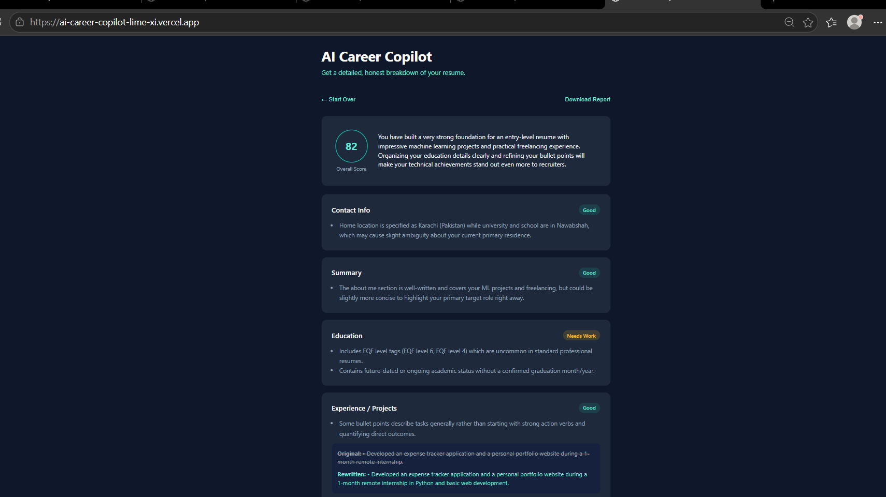
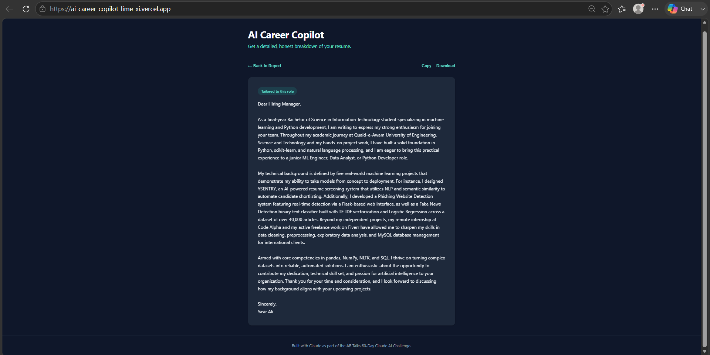

# AI Career Copilot

**Get a detailed, honest breakdown of your resume — powered by AI.**

🔗 **Live app:** https://ai-career-copilot-lime-xi.vercel.app

AI Career Copilot is a resume intelligence platform built for final-year students and early-career professionals writing their first professional resume. Upload a resume (PDF, DOCX, or paste text), optionally paste a job description, and get a detailed section-by-section diagnostic report: ATS-friendliness scoring, missing skills, rewritten weak bullet points, job-match percentage, and gap analysis — plus an AI-generated, tailored cover letter.

Built as the 10-day capstone project for the **ABTalks 60-Day Claude AI Mastery Challenge**.

---

## Screenshots

| Report | Cover Letter |
|---|---|
|  |  |

---

## Features

- **Resume upload or paste** — PDF and DOCX file support (via `pdf-parse` and `mammoth`), or paste text directly
- **Section-by-section analysis** — Contact Info, Summary, Education, Experience/Projects, Skills, and ATS Formatting, each scored and diagnosed individually
- **Missing skills detection** — flags skills commonly expected for the resume's apparent target field
- **Example rewritten bullet points** — before/after comparisons for the weakest lines, grounded only in real resume content (never invented)
- **Job description matching** — optional JD paste unlocks a match percentage and specific gap analysis against that role
- **AI-generated cover letter** — tailored to the job description when provided, reusing the same resume data
- **Fully stateless** — no accounts, no sign-up, no saved data. Upload, review, download, done.
- **Accessible** — full keyboard navigation, screen-reader support (`aria-live` regions), respects `prefers-reduced-motion`
- **Responsive** — works on mobile and desktop

## Tech Stack

- **Frontend:** Vanilla HTML/CSS/JavaScript (ES modules, no build step, no framework)
- **Backend:** Vercel Serverless Functions (Node.js)
- **AI:** Google Gemini API (`gemini-flash-lite-latest`, free tier)
- **File parsing:** `pdf-parse` (PDF), `mammoth` (DOCX)
- **Hosting:** Vercel

No database, no authentication — the product is intentionally stateless by design.

## Running Locally

### Prerequisites
- [Node.js](https://nodejs.org) (v18+)
- A free [Gemini API key](https://aistudio.google.com/apikey) (no credit card required)
- [Vercel CLI](https://vercel.com/docs/cli): `npm install -g vercel`

### Setup

```bash
git clone https://github.com/YasirAli-21/AI-Career-Copilot.git
cd AI-Career-Copilot
npm install
```

Copy `.env.example` to `.env` and add your Gemini API key:
```
GEMINI_API_KEY=your-actual-key-here
```

Run the local dev server:
```bash
vercel dev
```

Open the URL it prints (typically `http://localhost:3000`).

## Project Structure

```
AI-Career-Copilot/
├── api/              # Vercel serverless functions (backend)
├── lib/              # Shared config and utilities
├── prompts/          # AI prompt templates
├── public/           # Frontend (HTML/CSS/JS, no build step)
├── design/           # Frozen design-phase reference artifacts
├── docs/             # Full project documentation (PRD, architecture, daily logs)
└── vercel.json        # Deployment configuration
```

Full architecture and design documentation is in [`/docs`](./docs), including the original PRD, system architecture, API design, and a complete daily build log documenting the entire 10-day development process — including real bugs found and fixed along the way.

## License

MIT — see [LICENSE](./LICENSE).

## Acknowledgments

Built with Claude as part of the [ABTalks 60-Day Claude AI Mastery Challenge](https://github.com/YasirAli-21/AI-Career-Copilot).
