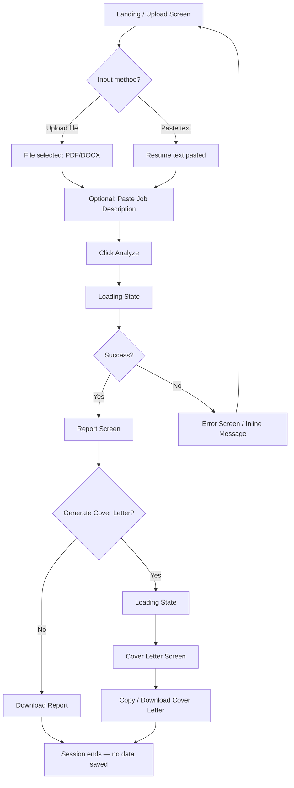

# AI Career Copilot — UI & User Flow

**Status:** Finalized Day 2 | Visual direction: dark/premium SaaS aesthetic (consistent with prior builds) | Palette: dark navy background, teal accent

## 1. User Flow Diagram



Every screen exists to serve exactly one step of the PRD's core user flow (Section 7) — there is no screen without a direct PRD justification.

---

## 2. Screen Inventory

| # | Screen | Purpose | PRD Reference |
|---|---|---|---|
| 1 | Landing / Upload | Entry point — collect resume input + optional JD | Flow step 1–2 |
| 2 | Loading (Analyzing) | Feedback during `/api/analyze` call | Flow step 3 |
| 3 | Report | Display the full `AnalysisReport` | Flow step 4 |
| 4 | Loading (Cover Letter) | Feedback during `/api/cover-letter` call | Flow step 5 |
| 5 | Cover Letter | Display generated letter + copy/download | Flow step 5 |
| 6 | Error / Inline Messages | Handle bad files, empty input, API failures | PRD §9 (graceful error handling) |

No accounts screen, no dashboard, no settings screen — all correctly excluded per locked scope.

---

## 3. Low-Fidelity Wireframes

### Screen 1 — Landing / Upload

```
┌──────────────────────────────────────────────────────────┐
│  AI CAREER COPILOT                                        │
│  Get a detailed, honest breakdown of your resume.         │
│                                                             │
│  ┌───────────────────────────────────────────────────┐   │
│  │                                                     │   │
│  │     [ ⬆  Drag & drop your resume (PDF/DOCX) ]      │   │
│  │            or click to browse                      │   │
│  │                                                     │   │
│  └───────────────────────────────────────────────────┘   │
│                                                             │
│                 — or paste your resume text —              │
│  ┌───────────────────────────────────────────────────┐   │
│  │  [ multi-line textarea ]                            │   │
│  └───────────────────────────────────────────────────┘   │
│                                                             │
│  Optional: Paste a job description for a targeted match    │
│  ┌───────────────────────────────────────────────────┐   │
│  │  [ multi-line textarea ]                            │   │
│  └───────────────────────────────────────────────────┘   │
│                                                             │
│                  [   Analyze My Resume   ]                 │
└──────────────────────────────────────────────────────────┘
```

### Screen 2 — Loading

```
┌──────────────────────────────────────────────────────────┐
│                                                             │
│                     ⟳  Analyzing...                        │
│         Reading through your resume section by section     │
│                                                             │
└──────────────────────────────────────────────────────────┘
```

### Screen 3 — Report

```
┌──────────────────────────────────────────────────────────┐
│  ← Start Over                          [ Download Report ] │
│                                                             │
│   ┌─────────────┐                                          │
│   │  78 / 100   │   "Solid foundation with clear project   │
│   │  Overall    │    experience. A few quick fixes..."     │
│   └─────────────┘                                          │
│                                                             │
│  ┌─ Contact Info ───────────────────────── ● Good ───┐     │
│  │  No issues found                                   │     │
│  └─────────────────────────────────────────────────────┘   │
│  ┌─ Summary ────────────────────────── ● Needs Work ─┐     │
│  │  • No summary/objective section found              │     │
│  └─────────────────────────────────────────────────────┘   │
│  ┌─ Experience / Projects ───────────── ● Needs Work ┐     │
│  │  • Bullets describe duties, not outcomes            │     │
│  │  ┌───────────────────────────────────────────────┐ │     │
│  │  │ Original:  "Worked on a resume screening..."   │ │     │
│  │  │ Rewritten: "Built an NLP-based resume..."      │ │     │
│  │  └───────────────────────────────────────────────┘ │     │
│  └─────────────────────────────────────────────────────┘   │
│  ┌─ Skills ─────────────────────────── ● Needs Work ─┐     │
│  │  Missing: [Git] [REST APIs] [SQL]                  │     │
│  └─────────────────────────────────────────────────────┘   │
│  ┌─ ATS Formatting ───────────────────────── ● Good ─┐     │
│  └─────────────────────────────────────────────────────┘   │
│                                                             │
│  ┌─ Job Match (only shown if JD was provided) ────────┐    │
│  │   72% Match                                         │    │
│  │   Gaps: Cloud deployment, FastAPI experience         │    │
│  └─────────────────────────────────────────────────────┘   │
│                                                             │
│              [   Generate Cover Letter   ]                 │
└──────────────────────────────────────────────────────────┘
```

### Screen 5 — Cover Letter

```
┌──────────────────────────────────────────────────────────┐
│  ← Back to Report                                          │
│                                                             │
│  Your Tailored Cover Letter          [Copy]  [Download]    │
│  ┌───────────────────────────────────────────────────┐    │
│  │  Dear Hiring Manager,                               │    │
│  │                                                      │    │
│  │  I am writing to apply for the...                   │    │
│  │  [ full letter text, scrollable ]                   │    │
│  │                                                      │    │
│  └───────────────────────────────────────────────────┘    │
└──────────────────────────────────────────────────────────┘
```

### Screen 6 — Error / Inline Message (example: bad file)

```
┌──────────────────────────────────────────────────────────┐
│   ⚠  Couldn't read that file.                              │
│      This may be a scanned or image-based PDF.             │
│      Try pasting your resume text instead.                 │
│                                                             │
│                    [   Try Again   ]                        │
└──────────────────────────────────────────────────────────┘
```

---

## 4. Navigation Rules

- **Linear flow, no persistent nav bar** — matches the stateless, single-session product. The only "navigation" is: Start Over (returns to Screen 1, clears all state) and Back to Report (returns from Cover Letter to the already-generated Report without re-calling `/api/analyze`).
- **No browser routing/URLs needed** for v1.0 — this is a single-page app with in-memory screen state, not multi-page navigation. Simpler to build, matches the "no accounts, no deep links to protect" scope.
- **Report state persists in memory** for the duration of the session so generating a cover letter never requires re-uploading or re-analyzing.

---

## 5. Visual Direction Notes (for Day 6 implementation)

- Dark background (navy, e.g. `#0F172A`), teal accent (e.g. `#14B8A6`) — consistent with the pitch deck and Yasir's established portfolio aesthetic.
- Status badges color-coded: green/teal = good, amber = needs work, red = missing.
- Card-based layout for each report section (rounded corners, subtle elevation) — reusable component across all six sections.
- Encouraging, human copy tone throughout (loading states, empty states, error states) — never robotic or alarming, per PRD tone requirement.
